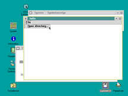
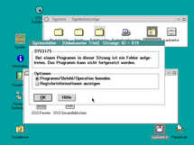
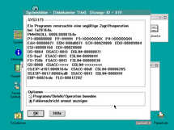
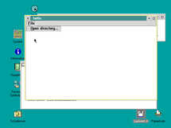
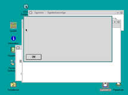
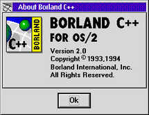
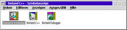
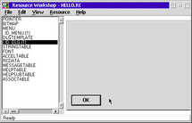
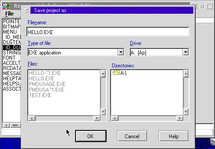

# Minimal reproducer for issue with Open Watcom v2 Resource Compiler

Note: This might very well be a user error.

# What happens?

Run `build.sh` on a Linux host to cross-compile the program using Open
Watcom v2. It creates an OS/2 2.x 32 bit PM executable.

Run the resulting `.EXE` file under OS/2. It is supposed to show a blank
white window with a menu bar. In the menu, you can click on `File` and
then `Open directory...`. A sample dialog window is supposed to appear.
A logfile `hello.log` will be created in the current directory to store
the return value of `WinDlgBox()`.

The window appears, including the menu bar, but the dialog does not
appear.

On OS/2 2.1, the program just crashes.

On OS/2 Warp 4, it does not crash but does not open the dialog, either.
We can see in the `hello.log` logfile that the return value of
`WinDlgBox()` is `DID_ERROR`.

# Comparison with Borland C++ for OS/2 Version 2.0

Borland C++ 2.0 includes the “Resource Workshop” program. I run it
natively on OS/2 Warp 4.

First, comment the call to `wrc` in `build.sh` and create an `.EXE` file
without any resources. Again, this is being done on Linux. The following
steps will use the Resource Workshop to augment this `.EXE` with our
resource info.

Second, remove the line `#include <os2.h>` from `hello.rc`. The Resource
Workshop will not be able to find this file and does not need it,
either.

Now copy all the files to OS/2.

You can load the modified `hello.rc` in the Resource Workshop. It
properly loads and interprets the file. You can now click `File` → `Save
file as` and specify `hello.exe` as the target.

This newly created `hello.exe` runs, shows the empty window, and a click
on the menu item properly pops up a dialog.

# Screenshots

## Watcom version crashing on OS/2 2.1

## Borland version running properly on OS/2 2.1

## Resource Workshop

